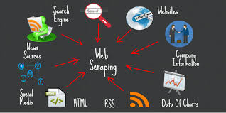

# Data-Scrapping
Data scraping, also known as web scraping, is the process of importing information from a website into a spreadsheet or local file saved on your computer. It’s one of the most efficient ways to get data from the web, and in some cases to channel that data to another website. 

Popular uses of data scraping include:
1.Research for web content/business intelligence
2.Pricing for travel booker sites/price comparison sites
3.Finding sales leads/conducting market research by crawling public data sources (e.g. Yell and Twitter)
4.Sending product data from an e-commerce site to another online vendor (e.g. Google Shopping)

